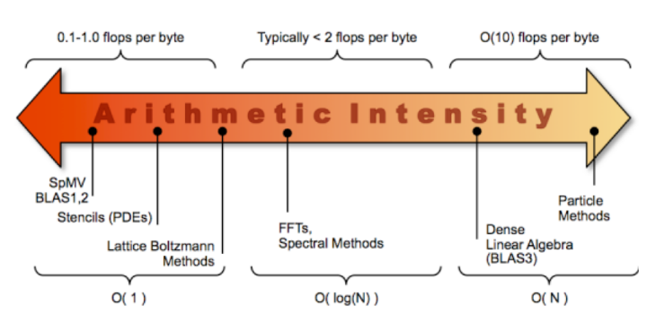
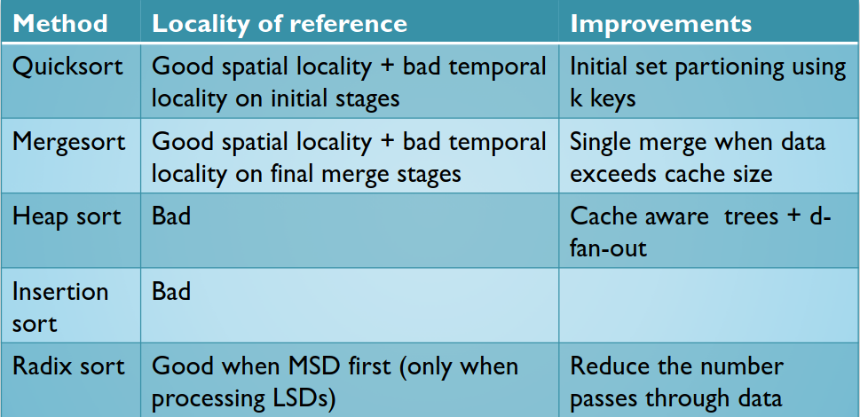
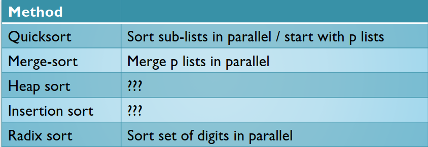

# Algoritmos Paralelos (*Sorting*)

## Algoritmos paralelos

- Análise Tradicional dos Algoritmos: Notação *Big-O*
  - Analise o número de operações de um pedaço de código;
    - Por exemplo, ordenação de 100 valores:
      - Mau algoritmo (*brute force*): $O(n^2)$;
      - Melhor: $O([k]n)$.
    - Ou inserção numa estrutura de dados:
      - Lista ligada ordenada: $O(n^2)$;
      - Árvore binária: $O(n\ log_2(n))$;
      - *Hash Table*: $O(n)$.
- Intensidade aritmética (operações por movimentações de dados):

## Algoritmos Paralelos de *Sorting*

### Em memória distribuída:

- Problemas de *design*:
  - Inicialmente, as chaves são distribuídas pelos processadores;
    - É um estágio intermédio para alguns algoritmos paralelos.
  - Propriedades dos dados;
    - Parcialmente ordenados.
  - Paralelismo Explorável;
    - *Merger-based*;
    - *Splitter-based*.
  - Considerações de eficiência para paralelismo:
    - Movimentos de dados entre processadores;
    - Balanceamento de carga;
    - Evitar o tempo em *idle* (isto é, fases sequenciais).

### *Merge-Sort* em Paralelo

- Localmente, ordena cada conjunto de dados;
- Efetua trocas de conjuntos entre os processadores;
- Apenas é efetivo quando $\frac{n}{p} \approx l$;
- Muitos movimentos de dados quando $\frac{n}{p} \gt \gt l$

### *Quicksort* em Paralelo (Simplificado)

- O *master* seleciona e faz *broadcast* da chave pivô;
- Cada processo, localmente, efetua a separação com base no pivô;
  - Cada processo irá conter uma partição *smaller* e uma partição *greater*.
- Divide os processadores em conjuntos de *smaller* e *greater*;
  - Envia dados para um processador acerca de outro conjunto.
- Repete o processo até que o número de conjuntos seja igual ao número de processadores;
- Localmente, ordena cada processo p.

**Complexidade**: precisa de $log(p)$ passos de comunicação

### *Radix Sort* em Paralelo

- Cada processador é responável por um subconjunto de valores dígitos;
- Ordena e conta o número de valores dígitos;
- Todos reduzem o número total de dígitos;
- Envia as chaves para o processador responsável pelo intervalo do dígito;
- Repete para o próximo dígito.

**Complexidade**:
- LSD - precisa de passos de comunicação equivalente ao número de dígitos a avaliar;
- MSD - preciso de um passo de comunicação.

### *Sampling Based*

- Separa os dados em $P$ conjuntos utilizando $p - l$ *splitters*;
- Cada processador age como um conjunto local;
- Minimiza os movimentos de dados.

### *Sampling Alternatives*

- *Regular Sampling* ($p \times (p - l)$ chaves);
  - Não é efetivo para grandes $p$.
- *Random Sampling*;
- *Histogram Sampling*.
