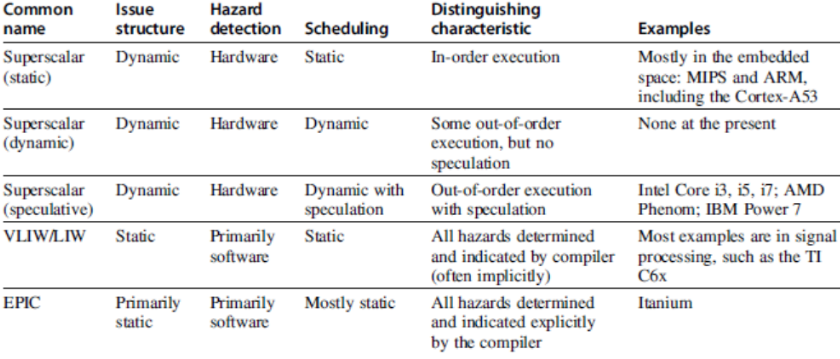

# Teórica 02

## Otimização de Código Sequencial

### Otimização de Desempenho

**Fases de Desenvolvimento**

1. Selecionar o melhor algoritmo;
   1. Utilizar a análise de complexidade para comprar algoritmos;
2. Escrever código legível e fácil de gerir;
3. Eliminar bloqueadores de otimizações;
4. Medir o perfil de execução.
   1. Otimar as partes críticas para o desempneho
      1. Operações repetidas muitas vezes (p.e. ciclos interiores)

- Código com otimizações é mais complexo de ler, manter e de garantir a correção.

## Paralelismo ao nível das Instruções

- O objetivo é maximizar o CPI.
  - *Pipeline CPI*:
    - *Pipeline* ideal do CPI +
    - *Structural Stalls* +
    - *Data Hazard Stalls* + 
    - *Control Stalls*

$$ CPU_{time} = \#Instr * CPI * Clk_{cycle} $$

- Paralelismo com bloco básico é limitado
  - Tamanho típico do bloco é de 3 a 6 instruções;
  - Deve ser otimizado entre *branches*.

## Dependência de Dados

- **Paralelismo ao nível dos *loops***
  - Desenrolar o *loop* estáticamente o dinâmicamente;
  - Utilizar o SIMD (processadores vetoriais e GPUs).
- ***Data Hazards***
  - *Read After Write* (RAW);
  - *Write After Write* (WAW);
  - *Write After Read* (WAR).
- **Dependências de Controlo**
  - Ordenação da instrução $i$ respeitando a instrução da *branch*.

## Previsão da *Branch*

- ***Basic 2-bit predictor***:
  - Para cada *branch*:
    - Prevê se o salto será dado ou não;
    - Se a previsão estiver errada 2 vezes consecutivas, altera-a.
- **Previsão de correlação**:
  - Múltiplos *2-bit predictors* para cada *branch*;
  - Um para cada combinação possível de *outcomes* das $n$ *branches* precedentes.
- **Agendamento Dinâmico**:
  - Reordena as intruções para reduzir *stalls* enquanto mantém o *flow* de dados.
- **Especulação Baseada em *Hardware***:
  - Executa instruções de acordo com a execução prevista, mas apenas apresenta os resultados no caso da previsão ser correta.

## *Multiple Issue*

- Uma forma de reduzir o CPI para < 1.

## Caso de Estudo

- Efetuar uma operação aritmética para todos os elementos de um vetor.
- 