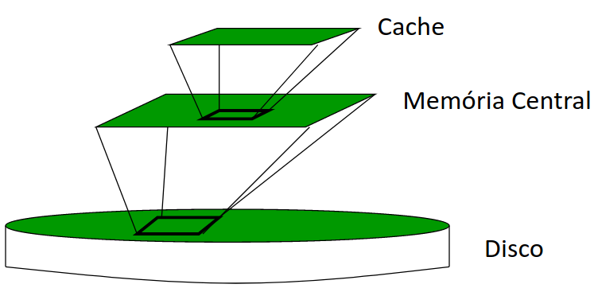
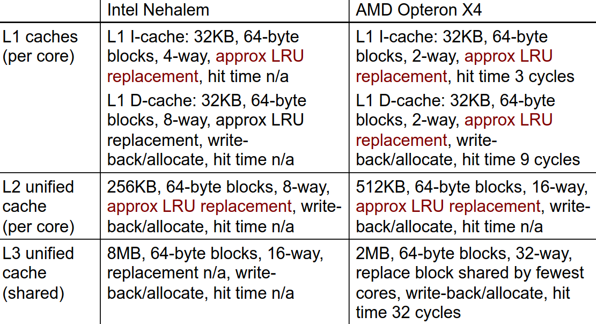
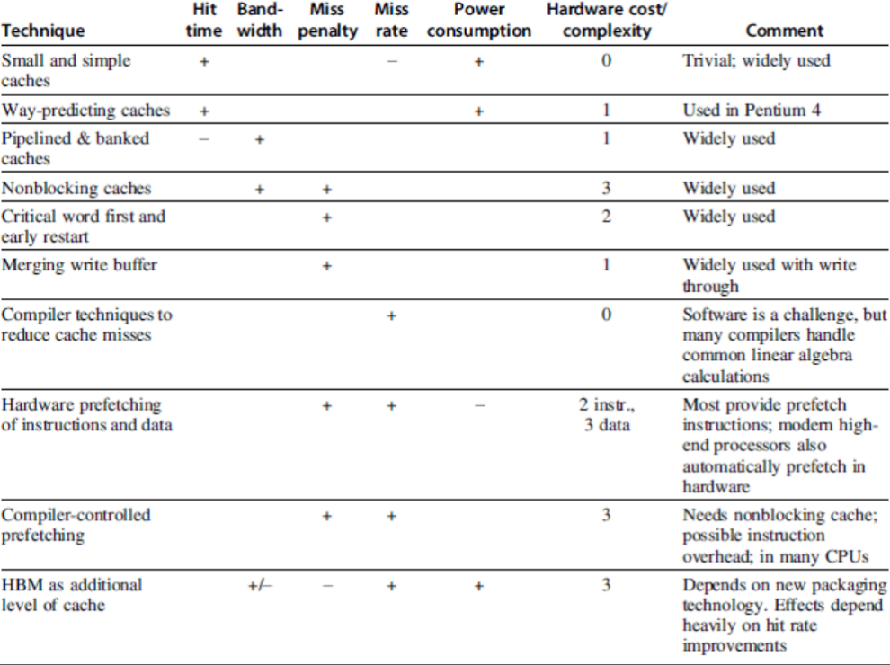

# Hierarquia de Memória

## Hiato Processador-Memória

- Para cada instrução, deve ser feito o seguinte processo:
  - Ler Instrução;
  - Ler Operando;
  - Escrever Resultado.
- O **hiato processador-memória** diz-nos:
  - "A memória é incapaz de alimentar o processador com instruções e dados com uma taxa suficiente de forma a mantê-lo constantemente ocupado".
- A causa para este problema é a diferente taxa de aumento do desempenho entre os processadores e a memória nos últimos anos;
- Trata-se de um dos principais obstáculos à melhoria do desempenho dos sistemas de computação.

## Princípio da Localidade

- Permite acelerar os acessos à memória através de uma hierarquia;
  - "Os programas tendem a aceder a uma porção limitada de memória num dado período de tempo".
- Permite utilizar memória mais rápida para armazenar a informação usada mais frequentemente/recentement;
- Permite tirar partido da largura de banda, uma vez que a informação transferida entre diferentes níveis da hierarquia é efetuada por blocos.

### Localidade Temporal

Um elemento de memória acedido pelo processador será, com grande probabilidade, acedido de novo num futuro próximo;

- **Exemplos**:
  - Tanto as instruções dentro dos ciclos, como as variáveis usadas como contadores de ciclos, são acedidas repetidamente em curtos intervalos de tempo.
- **Consequência**:
  - A 1ª vez que um elemento de memória é acedido deve ser lido do nível mais baixo (p.e. da memória central);
  - Da 2ª vez que é acedido, no entanto, é muito provável que este se encontre em *cache*, evitando-se assim o tempo de leitura da memória central.

### Localidade Espacial

Se um elemento de memória é acedido pelo CPU, então elementos com endereços na sua proximidade serão, com grande probabilidade, acedidos num futuro próximo.

- **Exemplos**:
  - As instruções do programa são, normalmente, acedidas em sequência, assim como, na maior parte dos programas, os elementos de vetores/matrizes.
- **Consequência**:
  - A 1ª vez que um elemento de memória é acedido, deve ser lido do nível mais baixo (p.e. memória central), no entanto, não será lido sozinho, mas sim com um bloco de elementos com endereços na sua vizinhança.
  - Se o processador, nos próximos ciclos, aceder a um endereço vizinho do anterior (p.e. próxima instrução ou próximo elemento de um vetor), a probabiliade desse elemento já estar em *cache* é elevada.

### Inclusão

- Os dados contidos num nível mais próximo do processador são um subconjunto dos dados contidos no nível anterior;
- O nível mais baixo contém a totalidade dos dados;
- Os dados são copiados entre níveis em blocos.

### Terminologia

- **Linha**: A *cache* encontra-se dividida em linhas. Casa linha terá o seu endereço (índice) e tem a capacidade de um bloco;
- **Bloco**: Quantidade de informaçõa que é transferida de cada vez da memória central para a *cache* (ou entre níveis de *cache*). É igual à capacidade da linha;
- ***Hit***: Diz-se que ocorreu um *hit* quando o elemento de memória acedido pelo CPU se encontra em *cache*;
- ***Miss***: Diz-se que ocorreu um *miss* quando o elemento de memória acedido pela CPU não se encontra em *cache*, sendo necessário lê-lo do nível inferior da hierarquia.
- ***Hit Rate***: Percentagem de *hits* ocorridos relativamente ao total de acessos à memória;
- ***Miss Rate***: Percentagem de *misses* ocorridos relativamente ao total de acessos à memória. ($Miss\ Rate\ = 1 - hit\ rate$);
- ***Hit Time***: Tempo necessário para aceder à *cache*, incluindo o tempo necessário para determinar se o elemento a que o CPU está a aceder se encontra, ou não, em *cache*;
- ***Miss Penalty***: Tempo necessário para carregar um bloco da memória central (ou de um nível inferior) para a *cache* quando ocorre um *miss*.

## Causas de *Misses*

- Os **3 C's**:
  - **Obrigatória**;
    - Primeira referência ao bloco.
  - **Capacidade**;
    - Blocos que são descartados e mais tarde são necessários.
  - **Conflito**;
    - O programa faz repetidas referências a endereços de diferentes blocos de forma a mapear a mesma localização em *cache*.
- **Coerência**:
  - Diferentes processadores devem ver o mesmo valor na mesma localização;
  - Duas fontes: *true-sharing* e *false-sharing*

## *Multilevel Caches*

De forma a evitar o máximo de *misses* possível, opta-se por uma arquitetura de *caches multilevel*. Assim, tem-se os seguintes níveis:

- *Cache* primária presa à CPU;
  - Muito pequena, mas rápida.
- *Cache* de nível 2;
  - Serve os *misses* da *cache* de nível 1;
  - Maior que a anterior, mas mais lenta, no entanto, mais rápida que a seguinte ou que a memória principal.
- *Cache* de nível 3 (em alguns casos, não existe e poderá já ser a memória principal);
  - Serve os *misses* da *cache* de nível 2;
  - Maior que a anterior, mas mais lenta, sendo mais rápida que a memória principal.
- Memória Principal.
  - Serve os *misses* da *cache* de nível 3 ou, caso esta não exista, os *misses* da *cache* de nível 2.

### Desempenho

$$CPU_{exec\-time}=(CPU_{clock\-cycles} + Mem_{stall\-cycles}) \times Clock\ cycle\ time$$
$$CPU_{exec\-time}=(IC \times CPI_{CPU} + \frac{Mem_{stall\-cycles}}{Instr}) \times Clock\ cycle\ time$$

- Com a introdução de uma *cache single-level*:
$$Mem_{stall\-cycles} = IC \times \dots Miss\ rate \dots Mem\ accesses\ \dots Miss\ penalty \dots$$
$$Mem_{stall\-cycles} = IC \times \frac{Misses}{Instruction} \times Miss\ Penalty$$
$$\frac{Misses}{Instruction} = \frac{Miss\ rate \times Memory\ accesses}{Instruction\ Count} = Miss\ Rate \times \frac{Memory\ Accesses}{Instruction}$$

- Para cada nível $i$ adicional de *cache*:
$$Mem\_accesses_{level_i} = \frac{Misses}{Instruction_{level_i - 1}}$$
$$Miss\_penalty_{level_i} = (Hit\ rate \times Hit\ time \times Miss\ rate \times Miss\ penalty)_{level_i + 1}$$

### *Miss Rates*

- *Local Miss Rate*
  - Dado pelo número de *misses* na *cache* dividido pelo total de acessos à *cache*;
  - Para o primeiro nível será igual ao $Miss\ rate_{L1}$ e para o segundo será $Miss\ rate_{L2}$.

- *Global Miss Rate*
  - Dado pelo número de *misses* na *cache* dividido pelo total de acessos à memória gerados pela PU;
  - Para o primeiro nível será igual ao $Miss\ rate_{L1}$, no entanto, para o segundo já será $Miss\ rate_{L1} \times Miss\ rate_{L2}$.

## Desempenho

Como é que a hierarquia de memória influencia o $T_{exec}$?

- Cada acesso à memória irá originar ciclos adicionais na execução do programa ($ \\#CC_{MEM}$) devido aos *misses*:

$$T_{exec} = ( \\#CC +  \\#CC_{MEM}) \times T_{CC}$$

- Cada *miss* implicará um aumento do $ \\#CC$ em ciclos de *miss penalty*, logo:

$$ \\#CC_{MEM} = no.\ miss \times miss\ penalty$$

Sendo que, o $no.\ miss$ será dado por:

$$miss\ rate \times no\ acessos\ mem$$

- Assim, visto que $ \\#CC =  \\#I \times CPI$, temos que:

$$T_{exec} =  \\#I \times (CPI_{CPU} + CPI_{MEM}) \times T_{CC}$$

- Em que:
  - $CPI_{CPU}$: número de ciclos que o processador precisa, em média, para executar cada instrução;
  - $CPI_{MEM}$: número de ciclos que o processador precisa de parar, em média, para esperar por dados da memória, visto que não foi capaz de encontrar estes em *cache*. Vulgarmente, designam-se por *memory stall cycles* ou *wait states*.

- Podemos calcular o $CPI_{MEM}$ da seguinte forma:

$$CPI_{MEM} = \\% acessos\ Mem \times miss\ rate \times miss\ penalty$$

- De notar que os acessos à memória devem-se a:
  - Acesso a dados (instruções de *Load* ou *Store*);
  - Busca de instruções.
- Como estes têm comportamentos diferentes, usam-se percentagens diferentes:
  - **Dados**: Apenas uma determinada percentagem de instruções irá aceder à memória ($\%Mem$), pelo que, $missrate_D$ referir-se-á ao acesso a dados;
  - **Instruções**: Todas as instruções são lidas da memória, logo a percentagem de acesso à memória será de 100\%, $missrate_I$ referir-se-á ao acesso às instruções;
  - Geralmente, a $missrate_I$ é menor que a $missrate_D$ devido à utilização da localidade espacial.
- Temos, então:

$$CPI_{MEM} = (missrate_I + \\% Mem \times missrate_D) \times misspenalty$$

## Coerência na *Cache*

- **Coerência**
  - Todas as leituras de um processador devem retornar o valor escrito mais recentemente;
  - Escritas para a mesma localização por dois processadores devem ser vistas na mesma ordem por todos os processadores;
  - Ou seja, a coerência deverá definir o comportamento para escritas e leituras na mesma localização da memória.
- **Consistência**
  - Ocorre quando um valor escrito deverá ser devolvido por uma leitura;
  - Se um processador escrever numa localização A e, posteriormente, numa localização B, qualquer processador que vir o novo valor de B, deverá também ver o valor de A;
  - Ou seja, a consistência deverá definir o comportamento para escritas e leituras respeito o acesso a outras localizações de memórias.

### Forçar a Coerência

- Uma *cache* coerente providencia:
  - Migrações: movimentos de dados;
  - Replicações: múltiplas cópias dos dados.
- Protocolos para implementar coerência em *caches*:
  - *Directory Based*
    - Manter o estado partilhado de cada bloco numa única localização;
  - *Snooping*
    - Cada *core* deverá seguir o estado de partilha de cada bloco.

## Otimizações Básicas

- Maior tamanho dos blocos;
  - Reduz o número de *misses* obrigatórias;
  - Aumenta a capacidade e as *misses* por conflito, bem como a *miss penalty*.
- Aumentar o tamanho total da *cache* para reduzir a *miss rate*;
  - Aumenta o *hit time* e o consumo energético.
- Maior associatividade;
  - Reduz as *misses* por conflito;
  - Aumenta o *hit time* e o consumo energético.
- Maior número de níveis de *cache*;
  - Reduz o tempo médio de acesso à memória.
- Dar prioridade a *misses* de leitura ao invés de *misses* de escrita;
  - Reduz a *miss penalty*.
- Evitar a tradução de endereços ao fazer indexação na *cache*:
  - Reduz o *hit time*.

## Tecnologias de Memória e Otimizações

- Métricas de desempenho:
  - Latência é uma preocupação da *cache*;
  - Largura de banda é uma preocupação dos multi-processadores e I/O;
  - Tempo de acesso;
    - Tempo entre um pedido de leitura e a chegada da *word* pretendida.
  - Tempo de ciclo.
    - Tempo minímio entre pedidos não relacionados à memória.
- A memória *SRAM* tem uma baixa latência, pelo que é utilizada para *cache*;
- Organizando os *chips* de *DRAM* em diversas pilhas providenciará uma grande largura de banda que deve ser utilizada para a memória principal.
- **SRAM**:
  - Precisa de pouca energia para reter o *bit*;
  - Precisa de 6 transístores por *bit*.
- **DRAM**:
  - Deve ser reescrita depois de lida;
  - Periodicamente, deve ser atualizada;
    - +/- 8ms (cerca de 5\% do tempo);
    - Cada lina pode ser atualizada em simultâneo.
  - Um transístor por *bit*;
  - As linhas de endereços são multiplexadas.
    - Metade superior do endereço: *row access strobe* (RAS);
    - Metade inferior do endereço: *column access strobe* (CAS).

## Memória *Flash*

- Tipo de EEPROM;
- Tipos:
  - **NAND** (mais densa);
  - **NOR** (mais rápida).

## Otimizações Avançadas

- Reduzir o *hit time*;
  - *Caches* de primeiro nível mais pequenas e simples;
  - Implementação de *way predict*.
    - Especulativamente, seleciona um caminho dos disponíveis antes de iniciar um acesso normal à *cache*. Ao seguir apenas o caminho precisto, em vez de todos os disponíveis, poupará o consumo energético.
- Aumentar a largura de banda;
  - Implementação de *pipelined caches*, *multibanked caches*, *non-blocking caches*.
- Reduzir a *miss penalty*;
  - Ter, primeiramente, a *critical word*, juntar os *buffers* de escrita.
- Reduzir a *miss rate*;
  - Otimizações do compilador.
- Reduzir a *miss penalty* ou a *miss rate* através de paralelismo.
  - *Hardware* ou compilador fazem *prefetching*.

## Resumo

