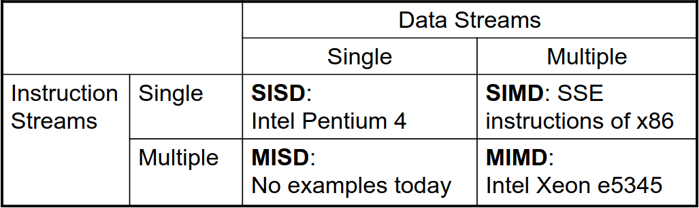

# Paralismo de Dados e *Multithreading* em Uniprocessadores

## Taxonomia de Flynn

- **SISD**: *Single Instruction, Single Data*;
- **SIMD**: *Single Instruction, Multiple Data*;
- **MISD**: *Multiple Instruction, Single Data*;
- **MIMD**: *Multiple Instruction, Multiple Data*;
- **SPMD**: *Single Program, Multiple Data*:
  - Programa paralelo num computador MIMD;
  - Precisa de código condicional para diferentes processadores.

## Introdução

- Arquiteturas SIMD permitem que se explore, de forma significativa, paralelismo ao nível dos dados para:
  - Computação científica orientada a matrizes;
  - Processamento de mídias;
  - Algoritmos de *Machine Learning*.
- Além disso, estas arquiteturas são mais eficientes que as MIMD a nível energético;
  - Precisam de dar *fetch* a uma única instrução por operação de dados;
  - Isto torna estas arquiteturas atrativas para dispositivos móveis pessoais.
- Por fim, esta arquitetura ainda permite que o programador tenha um pensamento sequencial.

## Paralelismo SIMD

- Arquiteturas vetoriais;
- Extensões SIMD;
  - É uma extensão ao *instruction set* do SIMD para arquiteturas x86 desenhada pela Intel;
  - Contém 70 novas instruções, sendo que grande parte trabalha com dados de *single precision floating-points*;
  - Estas instruções (e as instruções do SIMD), têm um grande ganho de desempenho quando efetuam exatamente as mesmas operações em múltiplos objetos de dados. Geralmente, são utilizadas para processamento de sinais digitais e para processamento gráfico.
- GPUs;
- Para processadores x86:
  - Expectável que se tenha 2 *cores* adicionais por ano;
  - A largura é expectável que duplique a cada 4 anos;
  - Potencial ganho de velocidade: 2x a velocidade do MIMD.

### Arquiteturas Vetoriais

- Ideia base:
  - Lê conjuntos de elementos de dados (da memória) para registos vetoriais;
  - Efetua operações sobre esses registos;
  - Dispersa os resultados obtidos de volta à memória (*scatter*).
- Os registos são controlados pelo compilador.
  - Utilizado para esconder a latência da memória;
  - Alavanca a largura de banda da memória.

#### VMIPS

- Exemplo: RV64V
  - Tem 32 registos vetoriais de 64 *bits*;
    - O ficheiro de registo tem 16 portas de leitura e 8 de escrita.
  - Unidades funcionais vetoriais;
    - Completamente em *pipeline*;
    - Deteta dependências de dados e de controlo.
  - Unidade vetorial de *load-store*;
    - Completamente em *pipeline*;
    - Uma *word* por *clock cycle* após a latência inicial.
  - Registos escalares.
    - 31 registos de propósito geral;
    - 32 registos de *floating-point*.

#### Desafios

- Tempo de arranque;
  - Latência de uma unidade funcional vetorial é bastante alta.
- Melhorias possíveis:
  - Mais do que 1 elemento por *clock cycle*;
  - *Non-64 wide vectors*;
  - Vetorizar o código de *if-statements*;
  - Otimizações ao sistema de memória de forma a suportar processadores vetoriais;
  - Múltiplas matrizes dimensionais (acessos à memória sem passos unitários);
  - Matrizes dispersas;
  - Programar de forma específica para um computador vetorial.

#### Programação Vetorial

- Os compiladores são elementos chave para dar dicas sobre se uma secção de código irá vetorizar ou nõa;
- Devemos verificar se as iterações entre *loops* terão depedências de dados e/ou *if-statements*, pois, caso contrário, a vetorização será comprometida;
- O custo de arquiteturas vetoriais é muito elevado, no entanto existem algumas variantes como extensões a processadores escalares, mas:
  - Não suportam acessos não unitários à memória, pelo que se deve ter cuidado na definição de estruturas de dados;
  - Também não suportam o *mask register*, *gather-scatter*, etc...

### Extensões a SIMD 

- Aplicações de mídia operam em tipos de dados mais pequenos que tamanho nativo de uma *word*;
- Limitações comparadas a arquiteturas vetoriais:
  - Número de operando de dados codificado no *op code*;
  - Não há modos de endereçamento sofisticados;
  - Não há *mask register*.

### Implementações SIMD

- Da Intel:
  - MMX (1996);
  - *Streaming SIMD Extensions* (SSE) (1999);
  - *Advanced Vector eXtensions* (AVX) (2010...);
    - Operações em 8 *32-bit fp* ou 4 *64-bit fp* (inteiros apenas no AVX-2);
    - Largura de *512-bits* no AVX-512 (e no Larrabee e Phi-KNC).
  - Os operandos têm de estar em localizações de memória consecutivas e alinhadas!
- AMD Zen/Epyc: semelhante ao AVX-2;
- Arquitetura ARMv8 (64-bit): NEON e SVE.

## Extensões Vetoriais

- Arquiteturas vetoriais/extensões SIMD são abordagens híbridas:
  - Mistura capacidades de operações (super)escalares + vetoriais num único dispositivo;
  - Abordagem altamente *pipelined* de forma a reduzir a *penalty* de acesso à memória;
  - Acesso fechado à memória partilhada provoca uma menor latência.
- Evolução destas arquiteturas:
  - Aceleradores de computação otimizados para *number crunching* (GPUs);
  - Adição do suporte a operações de multiplicação + acumulação para matrizes;
    - Muitas aplicações utilizam computações com matrizes, nomeadamente o *dot product*;
    - Os produtores, muitas vezes, chamam a esta extensão *Tensor Processing Unit* (TPU).
  - Suporte para *half-precision FP* e inteiros de *8 bits*.
    - Algoritmos de ML que utilizam redes neuronais precisam de computacionar um modelo durante a fase de treino, onde produtos de matrizes intensivos são feitos sem necessitarem de grande precisão.

## *Unicore Multithreading*

- Corre múltiplas *threads* numa execução em paralelo.
  - Partilha todos os recursos, exceto registos replicados, PC/IP, etc...
  - Troca rapidamente entre *threads*.
- Abordagens:
  1. *Fine-grain Multithreading*/*time-multiplexed multithreading*
     1. Troca de *threads* após cada *clock cycle*;
     2. Intercala a execução de instruções;
     3. Se uma *thread* parar, as outras são executadas.
  2. *Coarse-grain Multithreading*
     1. Só troca de *thread* em grandes paragens (p.e. uma *miss* na *cache* de nível 2);
     2. Simplifica o *hardware*, mas não esconde pequenas paragens (p.e. para dependências de dados).
  3. *Simultaneous multithreading*
     1. O processador agenda os múltiplos problemas de forma dinâmica:
        1. Agenda instruções das múltiplas *threads*;
        2. As instruções de *threads* independentes são executadas quando as unidades funcionais estiverem disponíveis;
        3. Entre *threads*, as dependências são geridas através do agendamento e renomeação de registos.
     2. Exemplo: Intel do *Pentium-4 HT*.
        1. Duas *threads*: registos duplicados, unidade funcional e *caches* partilhadas. 

