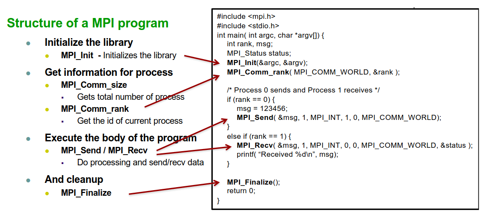

# Programação em Memória Distribuída com Passagem de Mensagens

## Passagem de Mensagens

### Conceitos Básicos

- A especificação de atividades paralelas é feita através de processos com espaços de endereçamento disjuntos;
  - Não existe memória partilhada entre os processos, pelo que tem de existir uma passagem de mensagens em paralelismo;
  - Os processos podem ser idênticos (SPMD, p.e. MPI) ou não (MIMD, p.e. PVM).
- As atividades paralelas comunicam através de portas ou canais;
  - O envio e a receção da mensagem são explícitos (de/para uma porta ou canal).
- Os dados devem ser explicitamente ordenados em mensagens;
- Existem primitivas de comunicação mais sofisticadas (*broadcast*, *reduction*, *barrier*).

### MPI: *Message Passing Interface*

- *Standard* para a passagem de mensagens;
  - Proveniente de um esforço para desenvolver aplicações paralelas portáteis (baseadas em memória distribuída).
- Baseado no modelo SPMD, ou seja, o mesmo código é executado em todos os processos;
- Passagem de mensagens com a entrega de mensagens *in order* utilizando uma comunicação ponto-a-ponto;
- Implementada como uma biblioteca de funções;
- Bibliotecas Comuns (*Open Source*): OpenMPI, MPICH e LamMPI;
- Principais *Features*:
  - Diversos modos para passagem de mensagens: síncronos e assíncronos;
  - Grupos/topologias de comunicação;
  - Conjunto largo de operações coletivas: *Broadcast*, *Scatter/Gather*, *Reduce*, *All-to-all*, *Barrier*;
  - MPI-2: processos dinâmicos, I/O paralelo, acesso remoto a memória (RMA - *put/get*);
    - Programação em memória partilhada limitada.
  - MPI-3: programação em memória explicitamente partilhada.

### SMPD: *Single Program Multiple Data model*

- O mesmo executável é lançado num conjunto de processos (isto é, em diversas máquinas);
  - Execução assíncrona do mesmo programa;
  - Cada processo tem um único identificador.
- O *rank* de cada processo é utilizado para definir o comportamento específico de cada processo.
  - *Process-specific control flow*;
    - Processamento de dados e comunicação inter-processos.
  - Veja-se o seguinte exemplo com 3 processos:

- É fácil de escrever um programa que funcione com um número arbitrário de processos (máquinas).

### Estrutura de um programa MPI

- Para compilar e executar:
  - **Compilar**: `mpicc` (`mpicxx` para C++);
  - **Executar**: `mpirun -np <num de processos> a.out`

### Mais Funcionalidades do MPI

- Comunicação ponto-a-ponto entre processos;
  - `int MPI_Send(void* buf, int count, MPI_Datatype datatype, int dest, int tag, MPI_Comm comm)`;
  - `int MPI_Recv(void* buf, int count, MPI_Datatype datatype, int source, int tag, MPI_Comm comm, MPI_Status *status)`;
  - Conteúdo da mensagem de dados: `void* buf, int count, MPI_Datatype datatype`;
    - Precisa que seja especificado o tipo de dados (`MPI_INT`, `MPI_DOUBLE`, etc...).
  - Cada processo é identificado pelo seu *rank* no grupo;
    - `dest/source` providenciam o destino e a fonte da mensagem;
    - Por *default* existe um grupo composto por todos os processos: `MPI_COMM_WORLD`;
    - A *tag* pode ser utilizada para distinguir diversas mensagens;
    - O `MPI_Recv` espera pela chegada de uma mensagem com as características especificadas.
      - Para identificarmos qualquer fonte ou qualquer tag, utiliza-se, respetivamente, `MPI_ANY_SOURCE` ou `MPI_ANY_TAG`.

### MPI - Modos da comunicação ponto-a-ponto

- ***Overhead* de passagem da mensagem**
  - Tempo de transferência da mensagem (copia-a para a rede, transmite-a na rede e entrega-a no *buffer* do recetor);
- O *standard* do `MPI_Send` pode ser implementado de diversas formas;
  - Não irá retornar até se poder usar o *buffer* de envio, assim, poderá ou não bloquear.
- Implementações explícitas para o envio (opções diferentes para *buffering* e sincronização):
  - `MPI_Ssend (blocking synchronous send)`
    - O emissor aguarda até à mensagem ser recebida;
  - `MPI_RSend (ready send)`
    - Retorna assim que a mensagem for colocada na rede;
    - O lado do recetor deve ter um `MPI_Recv` de forma a evitar *deadlocks*.
  - `MPI_BSend (buffered send)`
    - Retorna assim que a mensagem for colocada no *buffer* do lado do emissor;
    - Não sofre do *overhead* da sincronização com o recetor, mas poderá fazer a cópia apenas para um *buffer* local.
  - `MPI_lxxx (non-blocking sends)` com `MPI_wait`, `MPI_Test`, `MPI_Probe`.
    - Retorna imediatamente, sendo que o programador é que está responsável por verificar se a operação foi completada (utilizando o *wait*).

### MPI - Comunicações Coletivas

- `int MPI_Barrier(MPI_Comm comm)`;
  - Aguarda até todos os processos terem chegado à *Barrier*.
- `int MPI_BCast(void* buffer, int count, MPI_Datatype datatype, int root, MPI_Comm comm)`
  - Envia os dados em *broadcast* desde a raíz até todos os outros processos.
- `int MPI_Gather & int MPI_Scatter(void* sbuf, int scount, MPI_Datatype stype, void* rbuf, int rcount, MPI_Datatype rtype, int root, MPI_Comm comm)`
  - ***Gather***: Junta os dados de todos os processos na raíz;
  - ***Scather***: Separa os dados da raíz para todos os outros processos.
- `int MPI_Reduce(void* sbuf, void* rbuf, int count, MPI_Datatype stype, MPI_Op op, int root, MPI_Comm comm)`
  - Combina os resultados de todos os processos na raíz utilizando a operação especificada em `op`.
- Composições: *Allgather*, *Alltoall*, *Allreduce*, *Reduce_scatter*.

### MPI - Grupos

- Grupos de processos ordenados;
  - Cada processo tem um *rank* no grupo;
- Escopo para comincação coletiva e ponto-a-ponto

### MPI - Topologias

- Estruturas de processos bem definidas;
  - Cada processo tem um conjunto de vizinhos;
    - Fácil de identificar com uma topologia.
  - Comunicação através de canais.